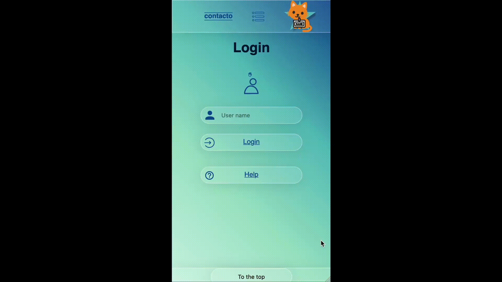

## contacto

  

This App - contacto - is meant for saving your contacts as well as providing
addiontal useful functions.

These functions include: Google Maps route calculation, sending an email,
calling and visiting the website of your contact.

contacto was developed as capstone project in a four weeks time frame for
neuefische Web Development Bootcamp.

This app is optimized for mobile usage, so it is best seen in responsive mode
(e.g. iPhone SE).

---

## App impressions

<h3>How to get help</h3>

<h3>Editing contacts</h3>

---

## Tech stack

- Next.js 
- React 
- styled-components 
- formik 
- cloudinary for image data storage
  

---

## How to set it up

- clone this repository
- install all npm dependencies  
   `npm install`
- to run the app in development mode `npm run dev`
- open [http://localhost:3000](http://localhost:3000) to view it in the browser
- to run Storybook  
  `npm run storybook`
- to run lint `npm run lint`
- to run prettier: `npm run prettier:write`
- to run React Testing Library & Jest  
  `npm test`
- to create a build ready for deploying: `npm run build`
